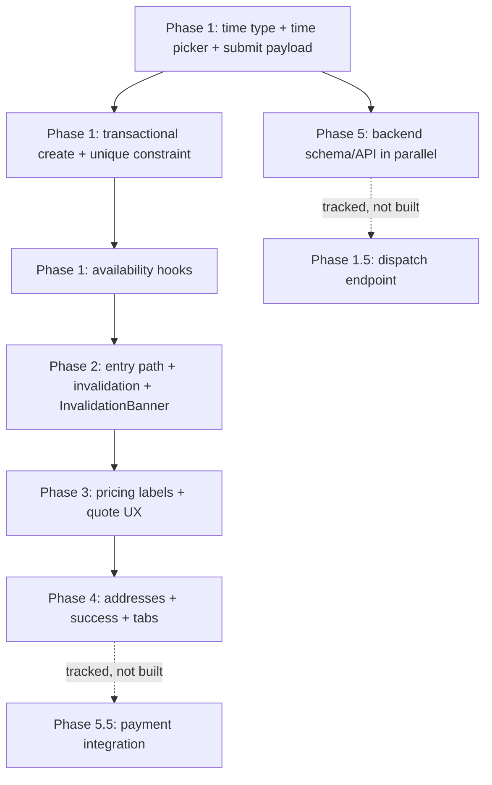

# Booking Flow Fix Plan v2 (File-by-File)

Builds on the original plan. Five changes from v1, all folded into the existing phases (no new phases added):

1. **Concurrency/race-condition handling** moved into Phase 1 as an explicit decision + implementation, not an assumption.
2. **Dispatch endpoint** decision resolved explicitly — Option B (remove "Any worker") chosen for now, Option A scoped as a tracked follow-up so it doesn't silently disappear.
3. **Invalidation UX** — every silent `invalidateSchedule()`/`invalidateWorker()` call now pairs with a user-visible reason.
4. **Time format enforced by type**, not convention.
5. **Payment gap made explicit** as a tracked follow-up, with interim UI copy that doesn't overclaim.

---

## Guiding decisions (updated)

| Decision                         | Recommendation                                                                                                                                                                                                                                                |
| -------------------------------- | ------------------------------------------------------------------------------------------------------------------------------------------------------------------------------------------------------------------------------------------------------------- | --------------------------------------------------------------------------- |
| "Any available worker"           | **Resolved: Option B for now.** Remove "Any worker" from UI until a dispatch endpoint exists. Tracked as **Phase 1.5 follow-up** (see below) — not silently dropped.                                                                                          |
| `scheduledTime`                  | Add `scheduledTime String?` to `Booking`, store as `HH:mm` (24h) internally, format for display only at the UI boundary. Enforce via a shared type, not a comment (see `TimeSlotPicker`).                                                                     |
| Draft persistence                | Fix hydration gap in step 1/step 2 (unchanged from v1).                                                                                                                                                                                                       |
| Price display                    | Step 1 = "estimate before tax & tip"; Step 3 = full breakdown (unchanged).                                                                                                                                                                                    |
| **Booking creation concurrency** | **New.** `createBooking` must wrap the availability check + insert in a single DB transaction with row-level locking (or a unique constraint on `(workerId, scheduledDate, scheduledTime)` as a backstop), not check-then-write. See Phase 1 backend section. |
| **Invalidation transparency**    | **New.** Every store action that clears a downstream field must also set a `lastInvalidationReason: string                                                                                                                                                    | null` the UI reads and surfaces (toast or inline note), not a silent reset. |
| **Payment processing**           | **New.** Not implemented yet. Interim: step 3 confirmation copy says "Submit booking request" everywhere (not "Confirm & Pay") until a real payment integration exists. Tracked as **Phase 5.5 follow-up**.                                                   |

---

## Phase 1 — Critical: submit blockers, date/worker sync, and concurrency (your #2, #4 + new concurrency item)

**Goal:** No booking can be submitted with a stale/invalid worker/date/task combo, and no two clients can double-book the same slot.

### `mobile/store/bookingStore.ts`

- Extend `DraftBooking`:
  ```ts
  entrySource: 'worker_profile' | 'new_booking' | null;
  workerLocked: boolean;
  workerName: string | null;
  lat?: number; lng?: number;
  lastInvalidationReason: string | null;   // NEW — drives UI toast/banner
  ```
- Add actions:
  - `invalidateSchedule(reason: string)` — clears `date`, `time`, `workerId` (unless `workerLocked`), sets `lastInvalidationReason`
  - `invalidateWorker(reason: string)` — clears `workerId` only when not locked, sets `lastInvalidationReason`
  - `clearInvalidationReason()` — called by UI after displaying the toast, so it doesn't re-fire on re-render
  - `validateDraftForSubmit()` — returns `{ ok: boolean; errors: string[] }`
- In `setDraft`, when `category`, `address`, or `city` changes → call `invalidateSchedule('Your service or address changed, so we cleared your date/time.')` if downstream fields were set.
- Remove/deprecate `processPayment()` (local-only path conflicts with API flow; see Phase 5.5).
- Map API response in `setBookingCreated()` to full `Booking` shape.

### `mobile/utils/bookingValidation.ts` _(new)_

Centralize rules used by step 2, step 3, and submit:

- Required fields: category, task (if config exists), address, date, **time**, workerId (worker required — no dispatch path yet), paymentMethod
- Re-check worker capacity for `(workerId, date)` — not just at pick time
- Re-check calendar constraints (lead time, off-days, blocked dates)
- Export `getDraftInvalidationReasons(draft)` for alerts

### `mobile/utils/time.ts` _(new — enforces format, closes v1 gap #4)_

```ts
// Single source of truth for time representation across the app.
export type TimeHHmm = string; // branded-in-spirit "HH:mm", 24h, e.g. "09:00", "14:30"

export function toDisplayTime(t: TimeHHmm, locale?: string): string {
  // "14:30" -> "2:30 PM"
}
export function isValidHHmm(t: string): t is TimeHHmm {
  /* regex check */
}
```

- `draft.time` is typed as `TimeHHmm` everywhere (store, validation, API payload).
- `TimeSlotPicker` writes `TimeHHmm` only; all display components call `toDisplayTime()`.
- `bookingValidation.ts` uses `isValidHHmm()` as a hard gate before submit — this is the enforcement point, not just a convention note.

### `mobile/hooks/useWorkerCapacity.ts`

- Change signature to `useWorkerCapacity(workerId: string | null, scheduledDate?: string | null)`.
- Fix: look up by `workerId` (not display name); filter active jobs overlapping `scheduledDate`.
- Return `{ isAtCapacity, isUnavailableForDate, activeJobCount, reason }`.

### `mobile/hooks/useBookingAvailability.ts` _(new)_

Composite hook used by step 2, select-worker, and step 3:

```ts
useBookingAvailability({ workerId, date, time, category })
→ { workerOk, dateOk, timeOk, warnings[], blockSubmit }
```

Re-runs whenever any dependency changes.

### `mobile/components/ui/TimeSlotPicker.tsx` _(new)_

- Morning / afternoon / specific slots.
- Disabled slots when worker unavailable (via `useBookingAvailability`).
- Writes `draft.time` as `TimeHHmm` exclusively (see `time.ts`).

### `mobile/app/(client)/booking/new/step-2.tsx`

- Add `TimeSlotPicker` below calendar.
- Gate "Next" on `date && time`.
- On date change → if worker was valid before but not for new date, call `invalidateWorker('This worker isn't available on the new date, so we cleared your selection.')` (unless locked) and show the reason as an inline banner (read `lastInvalidationReason`, then call `clearInvalidationReason()` on dismiss/next render).
- If `draft.workerLocked`: show worker as **read-only card**; "Change" opens confirm ("Leave this worker?").
- If `!draft.workerLocked`: **no "Any available worker" option** — user must choose a specific worker (see Decision table; Option A tracked separately, not built here).
- On mount + focus → run `useBookingAvailability`, surface warnings.

### `mobile/app/(client)/booking/select-worker.tsx`

- Read `draft.date`/`draft.time` from store; pass into `useWorkerCapacity`.
- Disable workers unavailable for selected date.
- Show banner when no date selected yet.

### `mobile/components/ui/BookingCalendar.tsx`

- Accept `workerId` prop, wire to `unavailableDates` from availability hook/API.
- Re-fetch blocked dates when locked worker + date changes.

### `mobile/app/(client)/booking/new/step-3.tsx`

- On mount: run `validateDraftForSubmit()`; if invalid, show blocking banner with links back to Step 1/2.
- Fix payload: `scheduledTime` (as `TimeHHmm`), `selectedAddOnIds` → mapped, `tip`, `paymentMethod`, `estimatedPrice`.
- Confirmation modal copy: "Submit booking request" (not "Confirm & Pay" — see Phase 5.5).

### `mobile/services/api.ts`

- Add `getWorkerAvailability(workerId, date)`.
- Extend `createBooking()` payload: `addOns`, `tip`, `paymentMethod`, `scheduledTime`.
- **No** `createBookingWithDispatch()` yet — see Phase 1.5 follow-up.

### `backend/prisma/schema.prisma`

- Add `scheduledTime String?` to `Booking`.
- **New:** add a unique constraint as a hard backstop against double-booking:
  ```prisma
  @@unique([workerId, scheduledDate, scheduledTime], name: "worker_slot_unique")
  ```
  This doesn't replace the transaction check below — it's the last line of defense if the transaction logic has a bug or a future code path bypasses it.

### `backend/src/controllers/bookingController.ts`

- **New (closes concurrency gap):** wrap the availability check + booking insert in a single DB transaction (e.g. `prisma.$transaction`) that:
  1. Locks/re-reads the worker's active jobs for the requested `(date, time)` window inside the transaction
  2. Rejects if capacity is exceeded
  3. Inserts the booking
  4. Commits
  - This mirrors whatever transaction pattern is already used in accept-booking — reuse it rather than writing a second one.
  - On unique-constraint violation (race that slipped through), return a clear 409 "slot no longer available" error, and have the client show "Someone just booked this slot — pick another time" rather than a generic error.
- Persist `scheduledTime`, `tip`, add-ons (`BookingAddOn` createMany).

### `backend/src/middleware/validation.ts`

- Keep `scheduledTime` required once UI collects it; validate `HH:mm` format server-side too (don't trust the client type alone).
- Validate `addOns` array shape if sent.

---

## Phase 1.5 — Dispatch endpoint (tracked follow-up, not built now)

Explicitly deferred, not silently dropped:

- **Ticket:** "Any available worker" dispatch — backend assigns an available worker server-side given `(category, date, time, address)`.
- Needs: a matching/queue strategy (nearest available? round-robin? load-balanced?), plus its own concurrency handling (two dispatch requests racing for the same worker).
- **Do not re-add the "Any worker" UI option until this exists and is tested** — re-introducing it early was the original bug.

---

## Phase 2 — Entry-path consistency + stale upstream edits (your #1, #4)

**Goal:** Profile entry and "New Booking" entry behave predictably; upstream edits invalidate downstream _with a visible reason_.

### `mobile/app/(client)/category/worker/[workerId].tsx`

On "Book Now":

```ts
setDraft({
  category: normalizeCategory(worker.service),
  workerId: worker.id,
  workerName: worker.name,
  workerLocked: true,
  entrySource: "worker_profile",
});
router.push("/(client)/booking/new/step-1");
```

### `mobile/app/(client)/booking/index.tsx`

On "New Booking" / FAB:

```ts
clearDraft();
router.push("/(client)/booking/new/step-1");
```

### `mobile/utils/categoryMapping.ts` _(new)_

Map worker/service labels → `serviceConfigs[].categoryName`. Used by worker profile, step 1, and API `serviceType`.

### `mobile/app/(client)/booking/new/step-1.tsx`

- Hydrate local state from draft on mount (fixes persistence gap):
  ```ts
  useEffect(() => {
    setCategory(draft.category);
    setDescription(draft.description);
    setSelectedAddOns(draft.selectedAddOnIds);
  }, []);
  ```
- When category changes → `invalidateSchedule('Changing the service cleared your date/time since availability may differ.')`.
- When address changes → extract/set `city`; show reason if this affects availability later.
- Price card label: "Estimated subtotal (before tax & tip)".
- If `workerLocked`, show locked worker banner.
- **New:** anywhere `lastInvalidationReason` is set, render a dismissible inline banner (shared component, `InvalidationBanner`, reused across step-1/2/3) — this is the concrete implementation of the "invalidation transparency" decision, not left to individual screens to remember.

### `mobile/components/ui/InvalidationBanner.tsx` _(new)_

- Reads `draft.lastInvalidationReason` from the store.
- Renders a small dismissible banner; calls `clearInvalidationReason()` on dismiss or on navigating forward.
- Single component reused in step-1, step-2, step-3 so the UX is consistent rather than ad hoc per screen.

### `mobile/app/(client)/booking/new/_layout.tsx`

- On mount: `restoreDraft()`.
- Optional: "Continue your booking?" resume prompt if draft has partial data.

### `mobile/store/bookingStore.ts` (invalidation rules, with reasons)

| Upstream change  | Invalidate                                        | User-facing reason                                               |
| ---------------- | ------------------------------------------------- | ---------------------------------------------------------------- |
| `category`       | task, add-ons, date, time, worker (if not locked) | "Changing the service cleared your date/time/worker."            |
| `address`/`city` | date, time (future: service area)                 | "Changing your address may affect availability."                 |
| `selectedTaskId` | date, time                                        | "This task takes different time, so we cleared your slot."       |
| `date`           | time; revalidate worker                           | "Your worker isn't available at the previous time on this date." |
| `time`           | revalidate worker                                 | "Your worker isn't available at this time."                      |

---

## Phase 3 — Pricing transparency + quote expectations (your #3, #8)

### `mobile/utils/pricing.ts`

- `getEstimateLabel(step: 1 | 3)` helper.
- `calculateDraftBreakdown(draft, serviceConfig)` — single source for step 1, step 2 summary, step 3.

### `mobile/components/ui/PriceBreakdown.tsx`

- `variant: 'estimate' | 'final'` — estimate hides tip row or shows "Tip added at checkout".

### `mobile/constants/serviceData.ts`

- Per-task flag: `pricingType: 'fixed' | 'quote_required'`.

### `mobile/app/(client)/booking/new/step-1.tsx`

- If task is `quote_required`, show callout: "Final price will be provided after worker inspection."

### `mobile/app/(client)/booking/new/step-3.tsx`

- Repeat quote disclaimer if applicable.
- Confirmation modal:
  - Fixed price: "Submit booking request" (payment collection deferred — see Phase 5.5)
  - Quote required: "Submit request — worker will send a quote before work begins"

### `mobile/app/(client)/booking/[bookingId]/quote.tsx`

- Wire `approveQuote`/`disputeQuote` to API (currently local-only).

### `mobile/app/(client)/booking/[bookingId]/index.tsx`

- Surface quote status in timeline; link to quote screen when `QuoteSubmitted`.

---

## Phase 4 — UX polish: addresses, success, list tabs (your #5–#7, #9)

### `mobile/app/(client)/booking/address-picker.tsx`

- Load saved addresses via `api.getAddresses()`.
- Section 1: saved addresses. Section 2: search + map.
- On confirm: set `address`, `city`, `lat`, `lng`.
- "Save this address to profile?" checkbox → `api.createAddress()`.

### `mobile/app/(client)/booking/success.tsx`

- Read from `selectedBooking`, not `draft`.
- Reference number = `selectedBooking.id`.
- Track button → `router.push(\`/(client)/booking/${selectedBooking.id}\`)`.
- "View Booking Details" primary action.
- Copy: "Booking request submitted" (matches Phase 5.5 interim payment copy).

### `mobile/app/(client)/booking/index.tsx`

- Status tab groups:
  ```ts
  const TAB_STATUS_MAP = {
    Pending: ["Pending", "QuoteSubmitted"],
    Active: ["Accepted", "Active", "InProgress", "QuoteApproved"],
    Completed: ["Completed"],
    Cancelled: ["Cancelled", "Disputed"],
  };
  ```
- Fetch bookings from API on focus (merge with cache).
- Don't reset tab to Pending on every focus — only on first mount.

### `mobile/app/(client)/booking/[bookingId]/index.tsx`

- Cancel/complete/status updates → `api.updateBookingStatus()` then update store.
- Fix worker display (`booking.worker` is a name string, not matched by id currently).

---

## Phase 5 — Backend/API alignment (supports all phases)

| File                                           | Change                                                                       |
| ---------------------------------------------- | ---------------------------------------------------------------------------- |
| `backend/prisma/schema.prisma`                 | `scheduledTime`, unique slot constraint, ensure `Payment` links to booking   |
| `backend/src/controllers/bookingController.ts` | Transactional create with add-ons/tip; availability check inside transaction |
| `backend/src/middleware/validation.ts`         | Align with schema; server-side `HH:mm` check                                 |
| `mobile/services/api.ts`                       | `getBookings`, `getBookingDetail`, quote approve/dispute endpoints           |
| `mobile/store/bookingStore.ts`                 | `fetchBookings()` action; hydrate list from API                              |

---

## Phase 5.5 — Payment integration (tracked follow-up, explicit gap)

Not built in this plan — flagged so it doesn't stay implicit:

- **Ticket:** real payment processing (charge on confirm, or charge on completion — decide which before building).
- Until this exists: all UI copy says "submit booking request," never "payment," never "Confirm & Pay."
- `paymentMethod` field in the draft is collected but **not charged** — make sure nothing in Step 3 implies otherwise (e.g., no "You were charged $X" confirmation).

---

## Suggested implementation order (sprints)



| Sprint                               | Files (max ~8 touches)                                                                                                                           | Outcome                                                                   |
| ------------------------------------ | ------------------------------------------------------------------------------------------------------------------------------------------------ | ------------------------------------------------------------------------- |
| **S1**                               | `time.ts`, `TimeSlotPicker`, `step-2`, `step-3`, `validation.ts`, `bookingController` (transaction), `schema.prisma` (field + unique constraint) | Bookings submit with valid time; double-booking prevented at the DB level |
| **S2**                               | `bookingValidation.ts`, `useWorkerCapacity`, `useBookingAvailability`, `select-worker`, `BookingCalendar`                                        | Date/worker stay in sync                                                  |
| **S3**                               | `bookingStore` (incl. `lastInvalidationReason`), `InvalidationBanner`, `step-1`, `[workerId].tsx`, `index.tsx`, `categoryMapping.ts`             | Entry paths consistent; invalidations are visible, not silent             |
| **S4**                               | `success.tsx`, `address-picker`, `index.tsx` tabs, `pricing.ts`, `serviceData.ts`                                                                | UX polish + pricing/payment-copy transparency                             |
| **S5**                               | `api.ts`, quote/detail screens, remove `processPayment`                                                                                          | Full backend sync                                                         |
| **Backlog (tracked, not scheduled)** | dispatch endpoint (1.5), payment integration (5.5)                                                                                               | Explicit follow-ups, won't silently vanish                                |

---

## Test checklist (per phase, updated)

**Phase 1**

- [ ] Cannot reach step 3 without date **and** time
- [ ] Submit with empty/malformed `scheduledTime` rejected client- and server-side
- [ ] Pick worker → change date → worker revalidated or warning shown
- [ ] **New:** two clients submit for the same worker/date/time concurrently → exactly one succeeds, the other gets a clear "slot no longer available" response
- [ ] **New:** unique constraint alone (bypassing the transaction check, e.g. via direct DB call in a test) still rejects the duplicate
- [ ] API accepts payload with add-ons, tip, time

**Phase 2**

- [ ] Profile → Book Now → worker locked through step 2
- [ ] New Booking → worker not pre-selected; must choose
- [ ] Change category on step 1 → step 2 date/worker cleared **and a banner explains why**
- [ ] Kill app on step 2 → reopen → draft restored + UI shows selections

**Phase 3**

- [ ] Step 1 subtotal label says "before tax & tip"
- [ ] Step 3 total matches step 1 subtotal + tax + tip
- [ ] Quote-required task shows disclaimer before submit

**Phase 4**

- [ ] Saved addresses appear in address picker
- [ ] Success screen shows real booking id and detail link works
- [ ] QuoteSubmitted booking appears under Pending tab

**Phase 5.5 (once scheduled)**

- [ ] No UI text implies a charge occurred until real payment integration ships

---

## Files touched summary (delta from v1 in bold)

| File                                                 | Action                                                              |
| ---------------------------------------------------- | ------------------------------------------------------------------- |
| `mobile/store/bookingStore.ts`                       | Extend draft, invalidation **+ reason field**, validation, API sync |
| `mobile/utils/bookingValidation.ts`                  | New                                                                 |
| `mobile/utils/categoryMapping.ts`                    | New                                                                 |
| **`mobile/utils/time.ts`**                           | **New — enforces `HH:mm` type**                                     |
| `mobile/hooks/useWorkerCapacity.ts`                  | Date-aware, id-based                                                |
| `mobile/hooks/useBookingAvailability.ts`             | New                                                                 |
| `mobile/components/ui/TimeSlotPicker.tsx`            | New, writes typed time                                              |
| `mobile/components/ui/BookingCalendar.tsx`           | Wire worker unavailable dates                                       |
| `mobile/components/ui/PriceBreakdown.tsx`            | Estimate vs final variant                                           |
| **`mobile/components/ui/InvalidationBanner.tsx`**    | **New — shared invalidation UX**                                    |
| `mobile/app/(client)/booking/new/step-1.tsx`         | Hydrate, labels, invalidation, banner                               |
| `mobile/app/(client)/booking/new/step-2.tsx`         | Time, worker lock, revalidation, banner                             |
| `mobile/app/(client)/booking/new/step-3.tsx`         | Full validation + payload, non-payment copy                         |
| `mobile/app/(client)/booking/select-worker.tsx`      | Date-aware capacity                                                 |
| `mobile/app/(client)/booking/address-picker.tsx`     | Saved addresses                                                     |
| `mobile/app/(client)/booking/success.tsx`            | Use `selectedBooking`, non-payment copy                             |
| `mobile/app/(client)/booking/index.tsx`              | Tab groups, API fetch                                               |
| `mobile/app/(client)/category/worker/[workerId].tsx` | Lock worker + normalize category                                    |
| `mobile/constants/serviceData.ts`                    | `pricingType`, quote flags                                          |
| `mobile/utils/pricing.ts`                            | Shared draft breakdown                                              |
| `mobile/services/api.ts`                             | Availability + extended create                                      |
| `backend/prisma/schema.prisma`                       | `scheduledTime` **+ unique slot constraint**                        |
| `backend/src/controllers/bookingController.ts`       | **Transactional** create + availability                             |
| `backend/src/middleware/validation.ts`               | Align with schema, server-side time format check                    |

---

## Explicitly deferred (tracked, not silently dropped)

- **Phase 1.5:** dispatch endpoint for "any available worker"
- **Phase 5.5:** real payment processing

Both are named here so they show up in planning/backlog grooming rather than disappearing the way "Any worker" almost did in v1.
