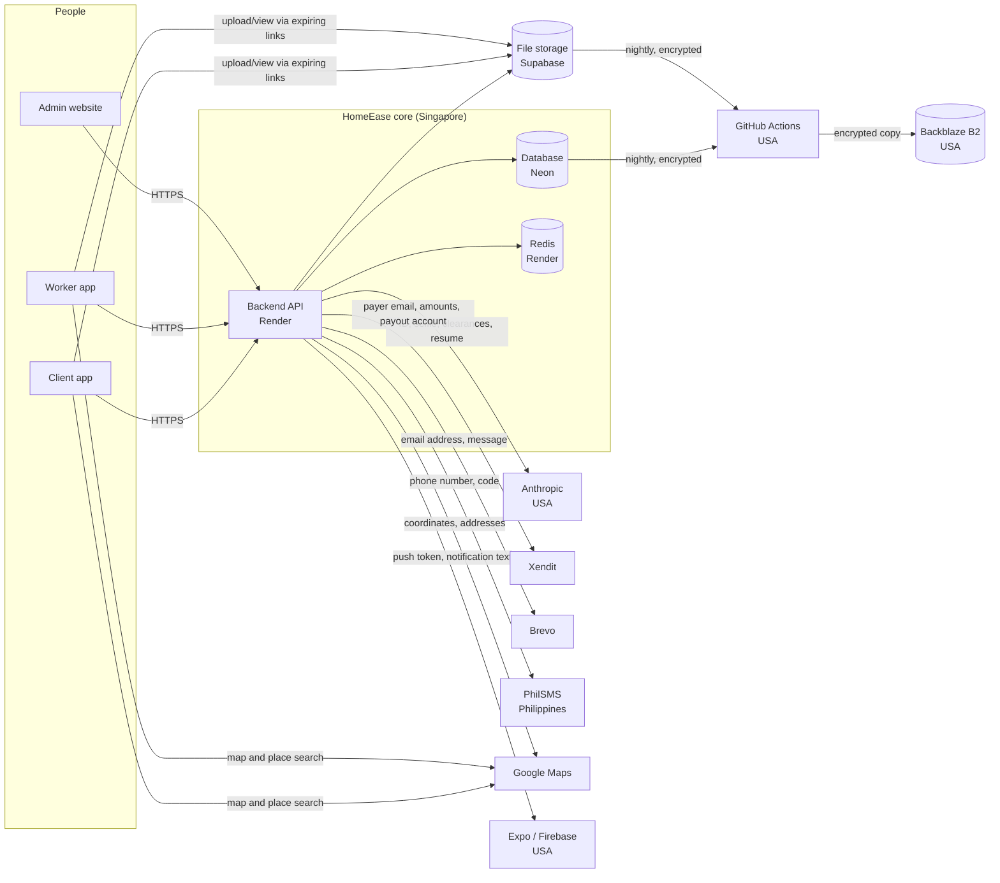

# Personal data map

Where personal data comes from, where it's kept, and which outside services
receive it. Used for the Privacy Policy ("Who sees your data"), for breach
assessment ([INCIDENT-RESPONSE.md](INCIDENT-RESPONSE.md), step 4), and for
answering "what do you hold about me?" requests.

**Keep it current:** a pull request that adds a new outside service, a new
kind of personal data, or a new place data is copied to updates this file
and the Privacy Policy (`mobile/constants/legalDocuments.ts`) in the same
change. Items marked *confirm* need checking in that provider's dashboard.

## How data flows

## What we hold, and where

| Data | Whose | Stored in | Sensitive? | Kept (see [DATA-RESILIENCE.md](DATA-RESILIENCE.md#retention-schedule)) |
|---|---|---|---|---|
| Name, email, phone, password hash, photo, push token, settings | Everyone | Database; photo in file storage | No | While the account is active |
| Service addresses and map pins, booking details and photos | Clients | Database; photos in file storage | No | Account data while active; bookings for the legal period |
| Government ID, selfie, clearances, health certificate, certifications | Workers | File storage (private buckets); review results in database | **Yes** (ID numbers, health, clearances) | Files while active, erased on account deletion |
| Resume and its AI summary | Workers | File storage; summary in database | No | While active |
| Date of birth, home address, years of experience | Workers | Database | No | While active |
| TIN | Workers | Database, **encrypted** | **Yes** | While active; as issued on tax certificates for the legal period |
| GCash/Maya payout account | Workers | Database, **encrypted** | No, but enables fraud | While active; on payout records for the legal period |
| Live location, check-in location, fake-GPS flag | Workers | Database | No | Live location at most 2 hours; check-in with the booking |
| Chat messages and photos, reviews, disputes | Clients, workers | Database; photos in file storage | No | Kept (the other person's record too) |
| Payment, payout, ledger and tax records | Clients, workers | Database | No | Legal period (tax and accounting law) |
| Sign-in records: logins, failed logins, MFA events (email, name) | Everyone, and people typing an email without an account | Database (audit log) | No | 1 year |
| Security alerts: the account involved and the IP address (e.g. repeated failed sign-ins, token theft) | Everyone | Database (audit log); alert emails | No | Kept (incident evidence) |
| Terms and consent acceptances (version, time, IP, device) | Everyone | Database | No | Kept (proof of consent) |
| Admin MFA secrets | Admins | Database, **encrypted** | No | While MFA is on |
| Server logs (requests, errors; no bodies or passwords) | Everyone | Render | No | Render's retention |
| Encrypted backups of all of the above | Everyone | Backblaze B2 | Contains sensitive data, encrypted | 30 nights |

## Outside services (processors)

| Service | What it receives | Why | Where |
|---|---|---|---|
| Render | Everything the API handles (in transit and in memory), server logs | Runs the backend and Redis | Singapore |
| Neon | The whole database | Database hosting | Singapore |
| Supabase | All uploaded files | File storage | *confirm: Supabase → Project Settings → General → Region* |
| Anthropic | Verification documents (ID, selfie, clearances) and resume text, for automated review | Helps admins review; never decides | USA |
| Xendit | Payment amounts and description, payer email; workers' payout account name and number | Payments and payouts | *confirm: Xendit (Philippines entity; data location per its privacy notice)* |
| Brevo | Email addresses, names, email contents (codes, booking notices) | Sending email | *confirm: Brevo (EU-based)* |
| PhilSMS | Phone numbers, text contents (codes, notices) | Sending SMS | Philippines |
| Google Maps Platform | Addresses and places typed, coordinates, route start and end points | Address search, maps, distances | USA / global |
| Expo and Google Firebase | Device push tokens, notification titles and text | Push notifications | USA |
| GitHub (Actions) | The database and files, briefly, while making the nightly encrypted backup; nothing is stored unencrypted | Backup runs | USA |
| Backblaze B2 | Encrypted backups (unreadable without our private key) | Off-site backup | USA |
| Vercel | Admin website files only; admins' IP addresses in its logs. Admin data goes straight to the API, not through Vercel | Hosts the admin website | Global |
| Sentry | *Not in use yet.* When turned on: error reports with personal data stripped | Error tracking | *confirm when enabled* |

Moving data to these providers abroad is allowed under the Data Privacy Act
as long as we stay accountable for it (contracts, security, telling users).
The Privacy Policy lists the providers and says data is stored outside the
Philippines.

## Answering "what do you hold about me?"

For a request from a user (right to access, Data Privacy Act §16): search
the database by user id for the tables above, list their files in each
bucket, and include audit log entries naming them. Send it within a
reasonable time (aim for 15 days), and verify it's really them first (reply
from the account's email, or a code sent to their phone). Deletion
requests: the in-app account deletion does it
([DATA-RESILIENCE.md](DATA-RESILIENCE.md#retention-schedule) lists what's
erased and what's kept).
